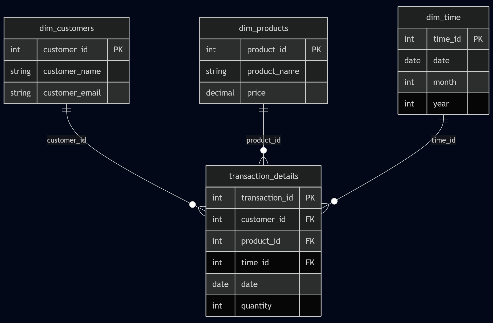

# Projet Data Engineering – DIA2 HETIC

## Objectif

Créer un pipeline **ELT complet** à partir d’un jeu de données e-commerce (Online Retail) pour :
- Ingestions automatisées avec Python
- Stockage brut dans PostgreSQL
- Modélisation relationnelle en étoile
- Transformations SQL et automatisation
- Documentation technique complète

---

## Stack technique

- Python (pandas, sqlalchemy, psycopg2, dotenv, logging)
- PostgreSQL
- Git / GitHub
- SQL pur
- pgAdmin

---

## Structure du projet

```bash
projet-data-engineering/
├── data/                         # Fichier brut CSV
│   └── Online_Retail.csv
├── Scripts/
│   ├── ingestion.py              # Script d’ingestion des données brutes  
│   └── run_pipeline.py           # Script d’automatisation du pipeline ELT
├── SQL/                          # Scripts SQL
│   ├── create_tables.SQL
│   ├── insert_dimensions.SQL
│   └── insert_facts.SQL
├── docs/                         # Présentation et schémas
│   ├── schema_pipeline.png
│   ├── schema_bdd.png
│   └── presentation_finale.pptx
├── .env                          # Variables d’environnement (non versionné)
├── .gitignore
└── requirements.txt
```

## Configurer l’environnement .env
- DB_USER=postgres
- DB_PASSWORD=motdepasse
- DB_HOST=localhost
- DB_PORT=5432
- DB_NAME=retail_project

## Exécuter le pipeline
python run_pipeline.py

## Schéma du pipeline ELT


## Schéma de la BDD

